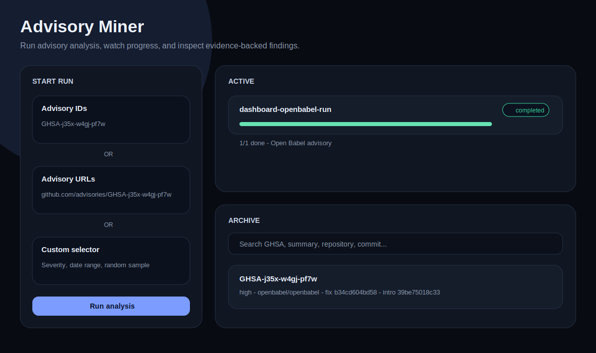
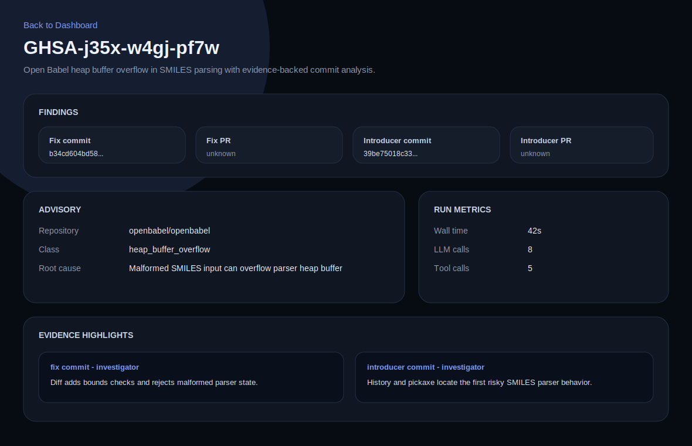

# GitHub Advisory Miner

Agentic security-advisory analyzer. Given a GitHub advisory, it finds:

- fixing commit and fixing PR, if any
- bug-introducing commit and introducing PR, if any
- evidence, confidence, limitations, and evaluation metrics

Final answers are evidence-gated: agents may investigate freely, but findings must be backed by Git/GitHub tool output. Unsupported PRs or commits remain `unknown`.

## How It Works

```text
collect advisory
  -> parse vulnerability semantics with LLM
  -> find fix candidates from GitHub/search/version ranges
  -> verify fix with focused diffs
  -> generate introducer candidates via blame, pickaxe, file history
  -> rank by advisory-specific code signals
  -> agentic investigator gathers mandatory git/GitHub evidence
  -> strict finalizer rejects hallucinated IDs and bad PRs
  -> critic + validators check ancestry, evidence, and confidence
  -> write JSON, Postgres rows, Langfuse traces/sessions
```

## Production Run

```bash
cp .env.example .env
# set OPENAI_API_KEY and preferably GITHUB_TOKEN

make prod-run ADVISORY=GHSA-j35x-w4gj-pf7w
```

This starts the full local production stack:

- analyzer worker
- Temporal + Temporal UI: http://localhost:8088
- Langfuse + Langfuse UI: http://localhost:3100
- app Postgres DB
- Langfuse Postgres, ClickHouse, Redis, and MinIO

Langfuse local login:

- email: `admin@localhost.dev`
- password: `password`

Project with traces: `advisory-miner-dev`.

## Dashboard

```bash
make dashboard
```

Open http://127.0.0.1:8765.

The dashboard is the easiest way to run and inspect the tooling. It supports:

- advisory IDs, e.g. `GHSA-j35x-w4gj-pf7w`
- advisory URLs, e.g. `https://github.com/advisories/GHSA-j35x-w4gj-pf7w`
- severity/date-range selection for batch collection
- random date-range sampling
- worker count and enrichment options
- force rescan when an advisory was already archived
- live progress for each advisory
- full detail pages with findings, evidence, metrics, limitations, and raw JSON
- a searchable archive of unique advisory IDs

If an exact GHSA ID was already scanned, the dashboard shows the archived result immediately unless `force rescan` is enabled.

### Screenshots





## Outputs

Dashboard and CLI outputs are written under `results/`. Dashboard archive metadata is stored under `.cache/dashboard/`. Production runs also persist results and evidence to the app Postgres DB.

## Dockerize Agent

The project also includes a separate Dockerize workflow for web apps:

```bash
make dockerize REPO=owner/repo
make dockerize REPO=/path/to/repo DOCKERIZE_REPO_LOCAL=1
```

It detects Node/Python/Go web apps, generates Docker assets when missing, validates with Docker Compose when possible, and reports a JSON outcome.

## Requirements

- Python 3.12+
- Docker and Docker Compose
- Git
- `uv` for local development commands
- `OPENAI_API_KEY`
- `GITHUB_TOKEN` recommended
